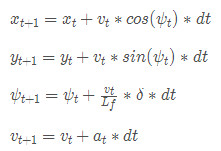

##CarND-Controls-MPC
###General Concepts

The basic idea of the MPC approach is to minimize a cost function associated with a kinematic model of a vehicle based on an estimated trajectory.  The model was used to predict how the vehicle will respond in the near future with actuator stimulus and known initial state. One should minimize the cost function  as the vehicle  simulator is running to produce a modeled vehicle trajectory that is close to the trajectory of interest.

###Kinematic Model

The kinematic model used in the project is the same model from the lessons.  The relationship between state at time t and time t+1 is as follows:

__State: [x,y,ψ,v]__
x,y: the position of the vehicle
ψ: the orientation of the vehicle
v: the velocity of the vehicle
__Actuators: [δ,a]__
δ: steering angle
a: acceleration (throttle/brake combined)
These equations are used to predict future states of car. This is done within the context of the Solve method, whereupon the solver optimizes the resulting system of equations with respect to the cost function that we define. There is more information about these ideas throughout the rest of this document.

###Polynomial Fitting

In this project, the simulator provides periodic waypoints. The waypoints are typically in the center of the road, and can act as a guide for the model. The waypoints  are in map coordinates and the car trajectory and motion control are in car coordinates, for convenient, one should convert  waypoints from the map to car coordinates. Then a 3th order polynomial interpolation is implemented so that points along the waypoint trajectory in front of the car can be computed. With this polynomial interpolation , one can easily compute the  __cte__  by evaluating the interpolation polynomial at x=0.  Similarly, the error angle __eψ__, which is the angle the car is directed from the axis at x=0, can be computed as arc-tangent of the derivative of the polynomial evaluated at x=0. I tried polynomials  beyond third order, but that tend to have untoward instability for large x values. This led to the model having erratic behavior, so I ended up using a 3rd order polynomial.

### Cost Function
To obtain controller that actuates the vehicle to follow the reference trajectory within a set of design requirements, one important requirement is to minimize the error between the center of the road and the vehicle's actual path which is expressed  as the cross track error(__cte__). The kinematic model can be used to predict the vehicle’s future state, and then one can adjust the actuators to minimize the difference between the prediction and the reference trajectory. The errors, combined with the other states, form the new state vector __[x,y,ψ,v,cte,eψ]__, and allows the model to iteratively compute position and ultimately minimize the cost function, yielding a best estimate of tracking the interpolated trajectory. The Cost Function is composed by the sum of the square of cte and eψ, along with  square of (v-rev_v) which deal with the stopping problem and square of  the change-rate of control input including __δ__ and __a__, which add temporal smoothness to the actuator. 

###Number of Model Steps and Timestep Interval

The number of solver steps and the time period between each step is something that depends in part on the speed of the solver on the particular computer, the speed of the car on the track, specific information about the track such as the tightness of turns, etc. On the one hand, the more points  the more contribution to the cost and the more options for the solver to find a minima. On the other hand, the more points cause the time it takes increases quickly, and the validity of the cost goes down as the model tracks more and more poorly with actual future car behavior. So, one should get a balance.

I started with 25 steps and a 50ms interval. This worked well for lower speeds. As the speed was increased, the distance that the car traveled of course increased in this period. The error increased and the stability of the car was compromised. As the speed increased, the distance computed needed to be reduced. There is a practical minimum interval having to do with the time it takes to perform the model calculation, so in general the strategy was decreasing the number of steps.At last, I chosen  10 steps and a 100ms interval, it seem to work well at 80mph.

###Latency Considerations
In a real car, an actuation command won't execute instantly - there will be a delay as the command propagates through the system. A realistic delay might be on the order of 100 milliseconds, this is a problem called "latency".  with a Model Predictive Controller, this latency in the system can be modeled with the car kinematic model. However, the latency will increase the mismatch between what the physical car is doing and what the simulated model is doing, just as the computation time consume in finding minimization of cost function, and  can cause  a decreasing stability of the car on the track, particularly at the turns.  The faster the car moves, the more that matters, and also it matters more on the turns.
###Turning MPC
Tuning the parameters can be a bit of a pain, because they impact each other, and as the parameters change, the selection of number of computation steps and the step time also require adjustment. Needless to say, the faster the vehicle goes, the more sensitive it is to these changes and the more prone it is to behave erratically.
